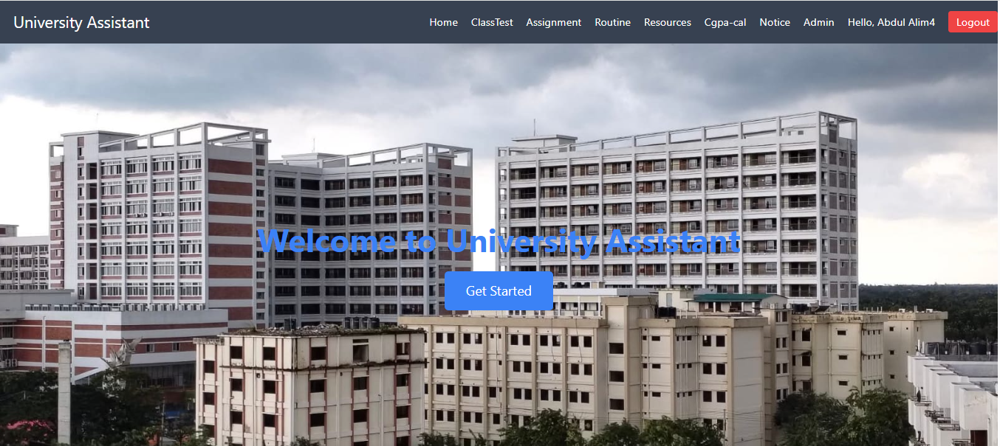
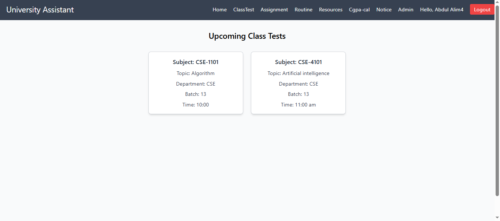
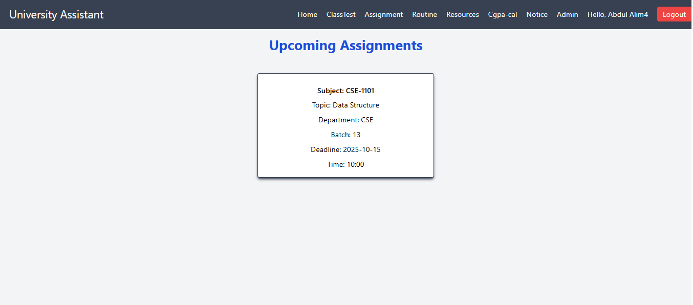
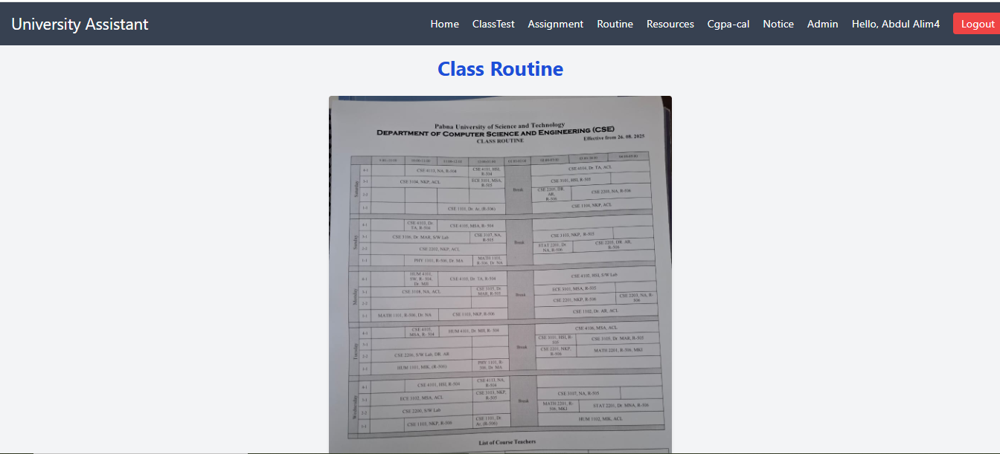
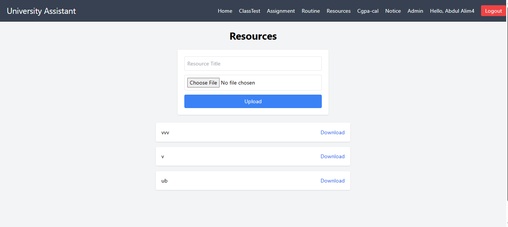
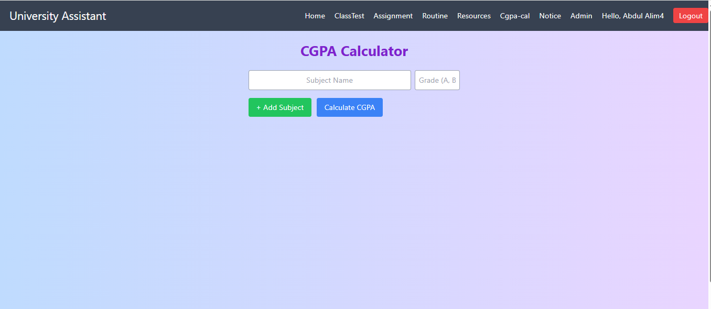
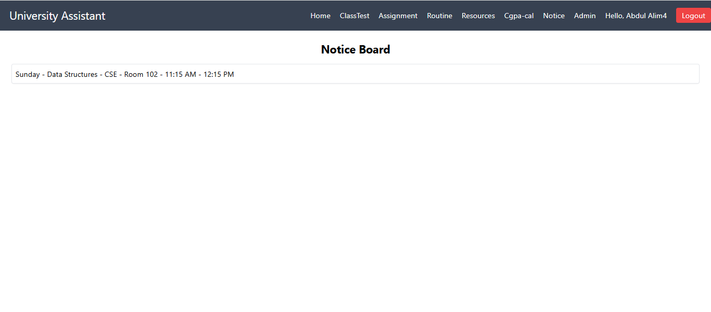
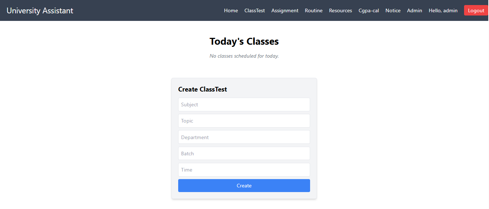
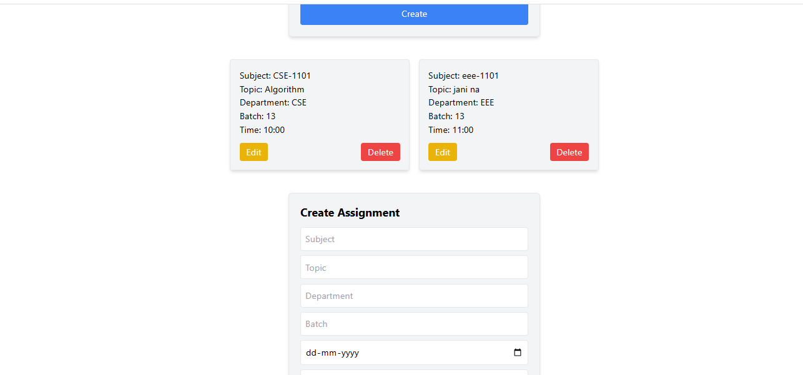

# University Assistant Frontend

React + Tailwind CSS frontend for the **University Assistant** full-stack web application.  
Supports role-based authentication, viewing upcoming classes, assignments, resources, CGPA calculation, and admin/teacher management.

---

## 🌐 Live Demo
[Click here to view the live app](https://fullstack-university-assistant-fron.vercel.app/)
---
### ⚙️ Backend
[Backend Repo](https://github.com/ALIM23700/FullstackUniversity_Assistant-Backend)

---

## 🛠 Tech Stack

- React.js  
- Tailwind CSS & DaisyUI  
- React Router DOM  
- Axios for API calls  
- LocalStorage for temporary auth/session state  

---

## ✨ Features

- Fully responsive design for desktop & mobile  
- Role-based authentication (Student / Teacher / Admin)  
- Students: view upcoming classes, assignments, class tests, download resources, CGPA calculator  
- Teachers/Admin: add/edit/delete upcoming classes, assignments, tests, routines  
- Approve next-day classes automatically for notice page  
- Department-based access control  
- Centralized notice system  

---

## 📸 Screenshots

### Home Page
  
*Dashboard showing upcoming classes and notices*

### Class Test
  
*View and track class tests*

### Assignment
  
*View and download assignments*

### Routine
  
*Weekly class routine*

### Resource
  
*Download academic resources*

### CGPA Calculator
  
*Calculate your CGPA easily*

### Next Day Notice
  
*Automatically updated notice for next day class*

### Admin Dashboard
  
  

---

# 1. Clone the frontend repo
git clone https://github.com/ALIM23700/FullstackUniversity_Assistant-Frontend.git

# 2. Navigate into the project folder
cd FullstackUniversity_Assistant-Frontend

# 3. Install dependencies
npm install

# 4. Start the app locally
npm run dev

# 5. Open in browser at
http://localhost:5173/

---

# 📁 Project Structure
src/  
├─ app/ → Redux state management & Backend API URL  
├─ components/ → Reusable UI components  
├─ pages/ → Home, Assignment, ClassTest, CGPA, Notice, Admin pages  
App.js → Main router & page rendering  

---

# 🚀 Future Improvements
- Integrate unit and integration tests  
- Enhance performance & lazy load images  
- Improve admin panel functionality  
- Add notifications/email reminders  
- Add multilingual support

  ---

# 📄 License
This project is licensed under the MIT License –  
you are free to use, modify, and distribute this project as you wish.  
